# Контекст компании «Медикаменте»
Компания «Медикаменте» предоставляет медицинские услуги в одном офисе с 20 сотрудниками и 15 медицинскими специалистами. Все операции с данными выполняются вручную: журналы приёма пациентов, учёт платежей, медицинские карты и анализы хранятся в Excel или в виде сканов на общем диске. Учёт финансов ведётся в «1С Бухгалтерия предприятия», интегрированной с контрольно-кассовыми машинами (ККМ). Учёт товарно-материальных ценностей (ТМЦ) осуществляется в «1С Торговля и склад». Компания планирует открыть новые филиалы, ожидая пятикратного роста данных, и усилить безопасность конфиденциальных данных в соответствии с законодательством РФ.

## Текущая архитектура (C4 модель)
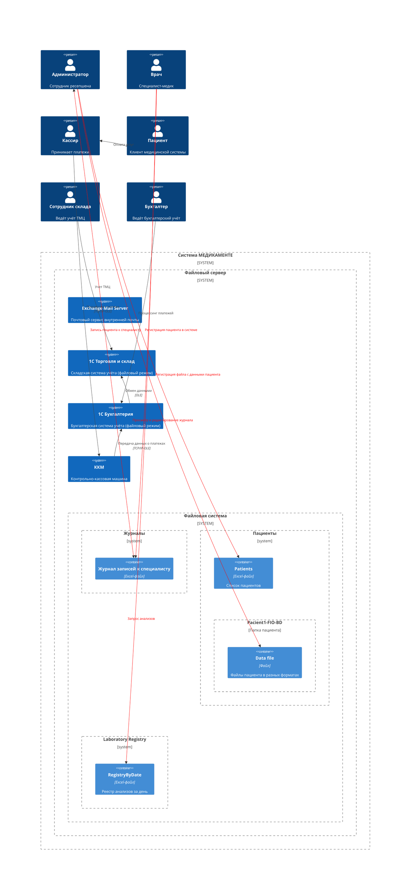
```mermaid
%%{ init: { "theme": "default", "themeVariables": { "fontFamily": "Arial" } } }%%
C4Context
    Person(administrator, "Администратор", "Сотрудник ресепшена")
    Person(doctor, "Врач", "Специалист-медик")
    Person(cassier, "Кассир", "Принимает платежи")
    Person(patient, "Пациент", "Клиент медицинской системы")
    Person(warehouse_keeper, "Сотрудник склада", "Ведёт учёт ТМЦ")

    Person(bookkeeper, "Бухгалтер", "Ведёт бухгалтерский учёт")
    System_Boundary(medicamente, "Система МЕДИКАМЕНТЕ") {
        System_Boundary(file_server, "Файловый сервер") {
            System_Boundary(file_system, "Файловая система") {
                Boundary(journals, "Журналы") {
                    Container(journal_doctor, "Журнал записей к специалисту", "Excel-файл")
                }
                Boundary(patients, "Пациенты") {
                    Boundary(patient_folder, "Pacient1-FIO-BD", "Папка пациента") {
                        Container(data_file, "Data file", "Файл", "Файлы пациента в разных форматах")
                    }
                    Container(patients_list, "Patients", "Excel-файл", "Список пациентов")
                }
                Boundary(lab_registry, "Laboratory Registry") {
                    Container(registry_by_date, "RegistryByDate", "Excel-файл", "Реестр анализов за день")
                }
            }

            
            System(mail_server, "Exchange Mail Server", "Почтовый сервис внутренней почты")
            System(trade_system, "1С Торговля и склад", "Складская система учёта (файловый режим)")
            System(buh_system, "1С Бухгалтерия", "Бухгалтерская система учёта (файловый режим)")
            System(kkm, "ККМ", "Контрольно-кассовая машина")
        }
    }

    BiRel(administrator, journal_doctor, "Запись пациента к специалисту")
    Rel(administrator, data_file, "Регистрация файла с данными пациента")
    Rel(administrator, patients_list, "Регистрация пациента в системе")
    Rel(doctor, journal_doctor, "Просмотр и редактирование журнала")
    Rel(bookkeeper, buh_system, "Процессинг платежей")
    Rel(warehouse_keeper, trade_system, "Учет ТМЦ")
    Rel(patient, cassier, "Оплата услуг")
    Rel(cassier, kkm, "Процессинг платежа", "TCP/IP-OLE")
    Rel(kkm, buh_system, "Передача данных о платежах", "TCP/IP-OLE")
    Rel(buh_system, trade_system, "Обмен данными", "OLE")
    Rel(doctor, registry_by_date, "Запрос анализов")
    UpdateRelStyle(administrator, journal_doctor, $textColor="red", $lineColor="red", $offsetX="-50", $offsetY="20")
    UpdateRelStyle(administrator, data_file, $textColor="red", $lineColor="red", $offsetX="-50", $offsetY="20")
    UpdateRelStyle(administrator, patients_list, $textColor="red", $lineColor="red", $offsetX="-50", $offsetY="20")
    UpdateRelStyle(doctor, journal_doctor, $textColor="red", $lineColor="red", $offsetX="-50", $offsetY="350")
    UpdateRelStyle(doctor, registry_by_date, $textColor="red", $lineColor="red", $offsetX="-50", $offsetY="700")
```

# Анализ конфиденциальных данных
## Категории конфиденциальных данных
Конфиденциальные данные, обрабатываемые, но не учтённые должным образом в системах компании, включают следующие категории:

- **Персональные данные пациентов**:
    - Обязательные: Ф. И. О., дата рождения, телефон, электронная почта.
    - Дополнительные: адрес прописки, место работы/учёбы, хронические заболевания, паспортные данные (в договорах), СНИЛС (для налоговых вычетов).
    - Проблемы: данные из расширенной формы, паспортные данные и СНИЛС хранятся в PDF/JPG без структурирования, классификации и защиты.

- **Медицинские данные**:
    - Результаты анализов, заключения врачей, медицинские карты, история посещений, рецепты.
    - Проблемы: данные в Excel/PDF не тегированы как чувствительные, не защищены от копирования, отсутствует связь с идентификаторами пациентов.

- **Финансовые данные**:
    - Суммы платежей, даты, способы оплаты (наличные, безналичные), банковские реквизиты (номера карт, счета).
    - Проблемы: реквизиты записываются вручную в Excel или бумажные журналы, не классифицированы как конфиденциальные, не защищены.

- **Данные сотрудников**:
    - Ф. И. О., паспортные данные, СНИЛС, банковские счета, зарплатные ведомости.
    - Проблемы: данные в «1С Бухгалтерия» доступны всем бухгалтерам без разграничения ролей, не шифруются.

- **Данные лабораторных анализов**:
    - Биомаркеры, результаты тестов, идентификаторы пациентов.
    - Проблемы: Excel-файлы в «Laboratory Registry» не защищены, доступны всем с доступом к серверу, могут быть изменены.

- **Дополнительные данные**:
    - Логи транзакций ККМ (идентификаторы, суммы, Ф. И. О. пациентов).
    - Уведомления в Exchange Mail Server (Ф. И. О., даты приёма, результаты анализов, медицинские данные).
    - Договоры в PDF (паспортные данные, подписи).
    - Проблемы: отсутствие фильтрации конфиденциальных данных в email и договорах, логи ККМ не защищены, данные не классифицированы.

## Проблемы учёта
- **Хранение**: Данные в Excel, PDF, JPG на файловом сервере доступны всем с доменной аутентификацией, без ролевого контроля (RBAC/ABAC).
- **Отсутствие аудита**: Операции (чтение, изменение, копирование) не логируются, что нарушает Data Lineage.
- **Неконтролируемые потоки**: Передача данных между ККМ, «1С», Exchange Mail Server и сотрудnikami не шифруется и не проверяется на целостность.
- **Ручная обработка**: Ввод данных вручную увеличивает риск ошибок и утечек.
- **Несоответствие ФЗ-152**: Отсутствие классификации, механизмов удаления данных по запросу и шифрования нарушает законодательство РФ.
- **Отсутствие Privacy by Design**: Системы не минимизируют данные (Data Minimization) и не защищают их по умолчанию.

## Data Flow Diagrams (DFD) для ключевых процессов
DFD отражают потоки конфиденциальных данных, включая добавленный процесс отправки результатов анализов и другие выявленные процессы.

### Процесс 1: Регистрация пациента на ресепшене
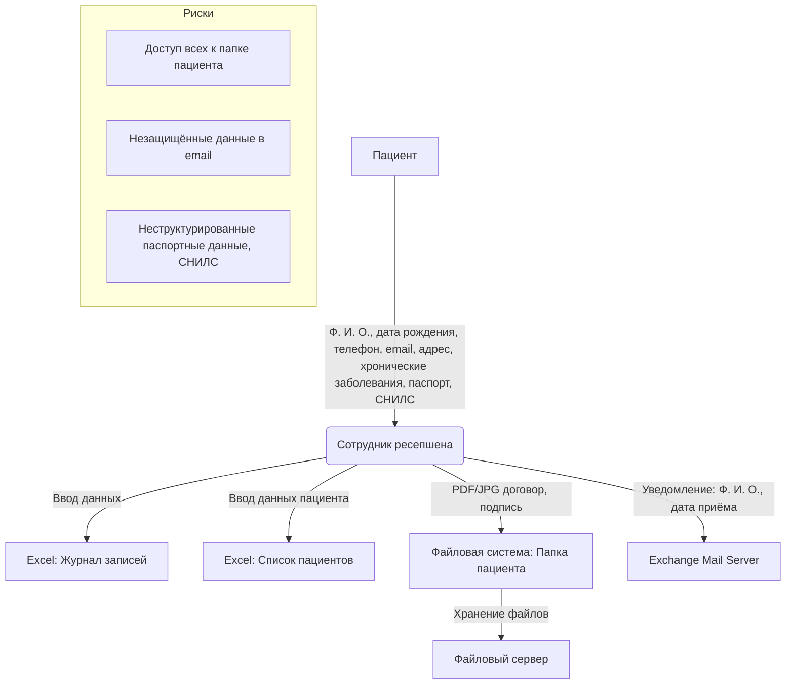
```mermaid
graph TD
    A[Пациент] -->|Ф. И. О., дата рождения, телефон, email, адрес, хронические заболевания, паспорт, СНИЛС| B(Сотрудник ресепшена)
    B -->|Ввод данных| C[Excel: Журнал записей]
    B -->|Ввод данных пациента| D[Excel: Список пациентов]
    B -->|PDF/JPG договор, подпись| E[Файловая система: Папка пациента]
    E -->|Хранение файлов| F[Файловый сервер]
    B -->|Уведомление: Ф. И. О., дата приёма| G[Exchange Mail Server]
    subgraph Риски
        R1[Доступ всех к папке пациента]
        R2[Незащищённые данные в email]
        R3[Неструктурированные паспортные данные, СНИЛС]
    end
```

### Процесс 2: Приём у врача и обработка медицинских данных
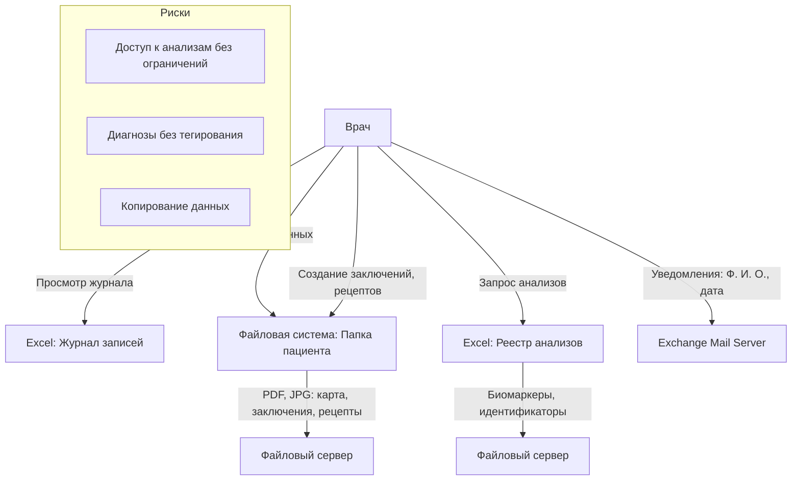
```mermaid
graph TD
    A[Врач] -->|Просмотр журнала| B[Excel: Журнал записей]
    A -->|Запрос данных| C[Файловая система: Папка пациента]
    C -->|PDF, JPG: карта, заключения, рецепты| D[Файловый сервер]
    A -->|Запрос анализов| E[Excel: Реестр анализов]
    E -->|Биомаркеры, идентификаторы| F[Файловый сервер]
    A -->|Создание заключений, рецептов| C
    A -->|Уведомления: Ф. И. О., дата| G[Exchange Mail Server]
    subgraph Риски
        R1[Доступ к анализам без ограничений]
        R2[Диагнозы без тегирования]
        R3[Копирование данных]
    end
```

### Процесс 3: Обработка платежей
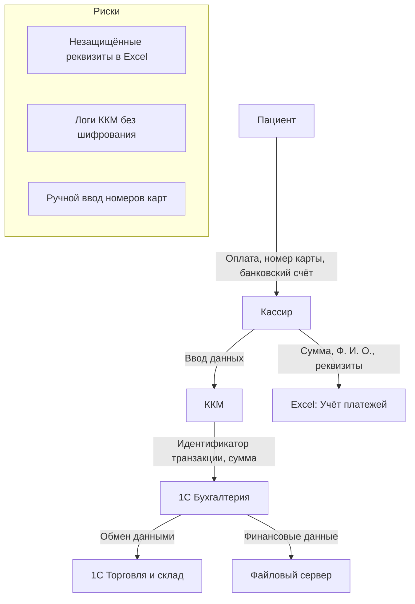
```mermaid
graph TD
    A[Пациент] -->|Оплата, номер карты, банковский счёт| B[Кассир]
    B -->|Ввод данных| C[ККМ]
    B -->|Сумма, Ф. И. О., реквизиты| D[Excel: Учёт платежей]
    C -->|Идентификатор транзакции, сумма| E[1С Бухгалтерия]
    E -->|Обмен данными| F[1С Торговля и склад]
    E -->|Финансовые данные| G[Файловый сервер]
    subgraph Риски
        R1[Незащищённые реквизиты в Excel]
        R2[Логи ККМ без шифрования]
        R3[Ручной ввод номеров карт]
    end
```

### Процесс 4: Учёт товарно-материальных ценностей (ТМЦ)
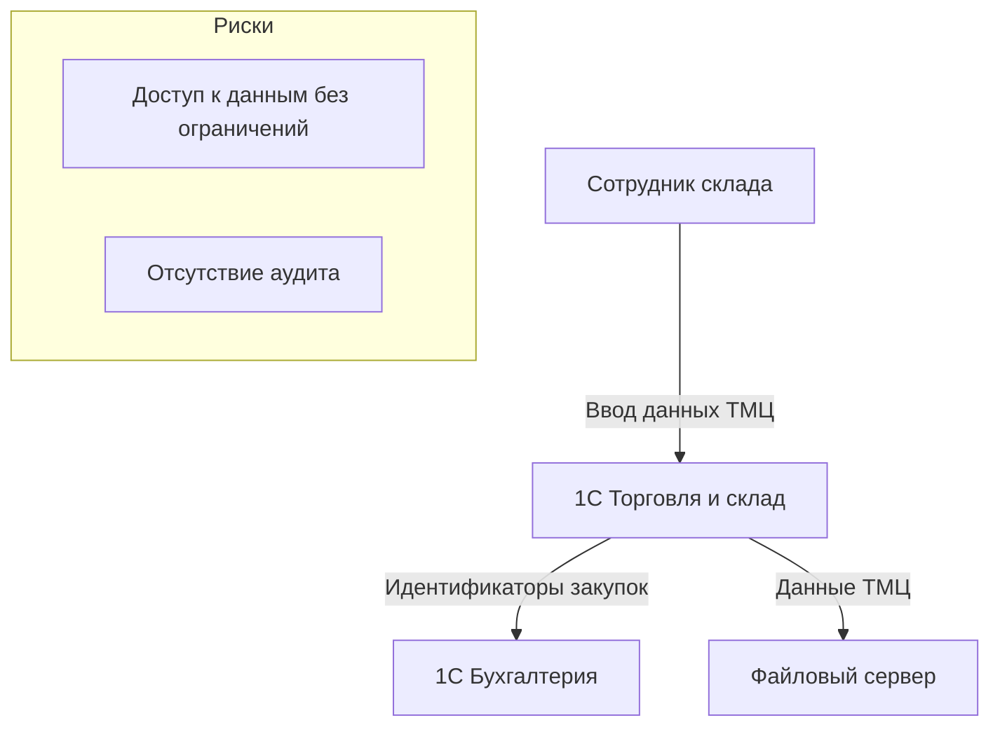
```mermaid
graph TD
    A[Сотрудник склада] -->|Ввод данных ТМЦ| B[1С Торговля и склад]
    B -->|Идентификаторы закупок| C[1С Бухгалтерия]
    B -->|Данные ТМЦ| D[Файловый сервер]
    subgraph Риски
        R1[Доступ к данным без ограничений]
        R2[Отсутствие аудита]
    end
```

### Процесс 5: Бухгалтерский учёт и кадровые данные
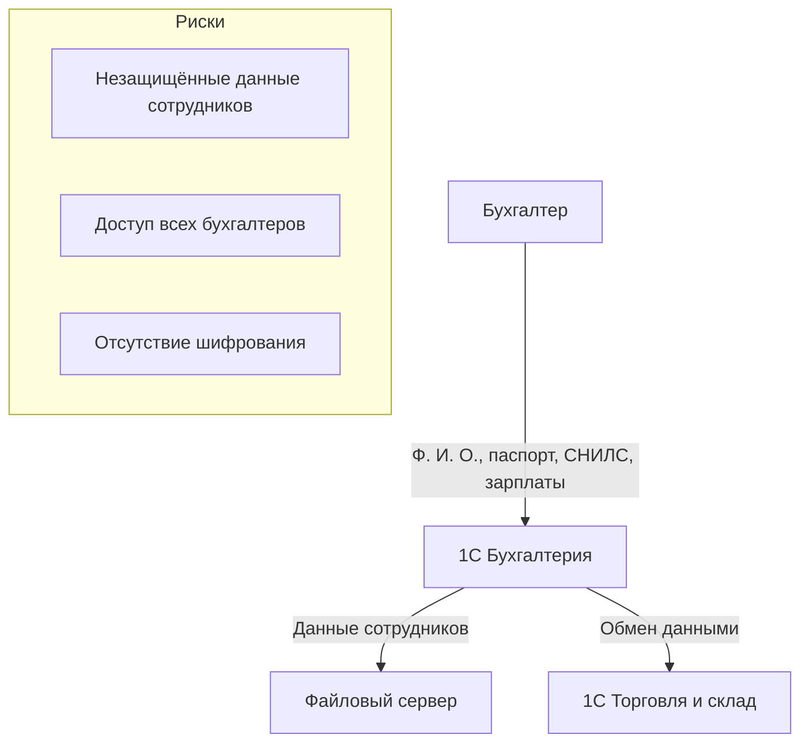
```mermaid
graph TD
    A[Бухгалтер] -->|Ф. И. О., паспорт, СНИЛС, зарплаты| B[1С Бухгалтерия]
    B -->|Данные сотрудников| C[Файловый сервер]
    B -->|Обмен данными| D[1С Торговля и склад]
    subgraph Риски
        R1[Незащищённые данные сотрудников]
        R2[Доступ всех бухгалтеров]
        R3[Отсутствие шифрования]
    end
```

### Процесс 6: Обработка лабораторных анализов
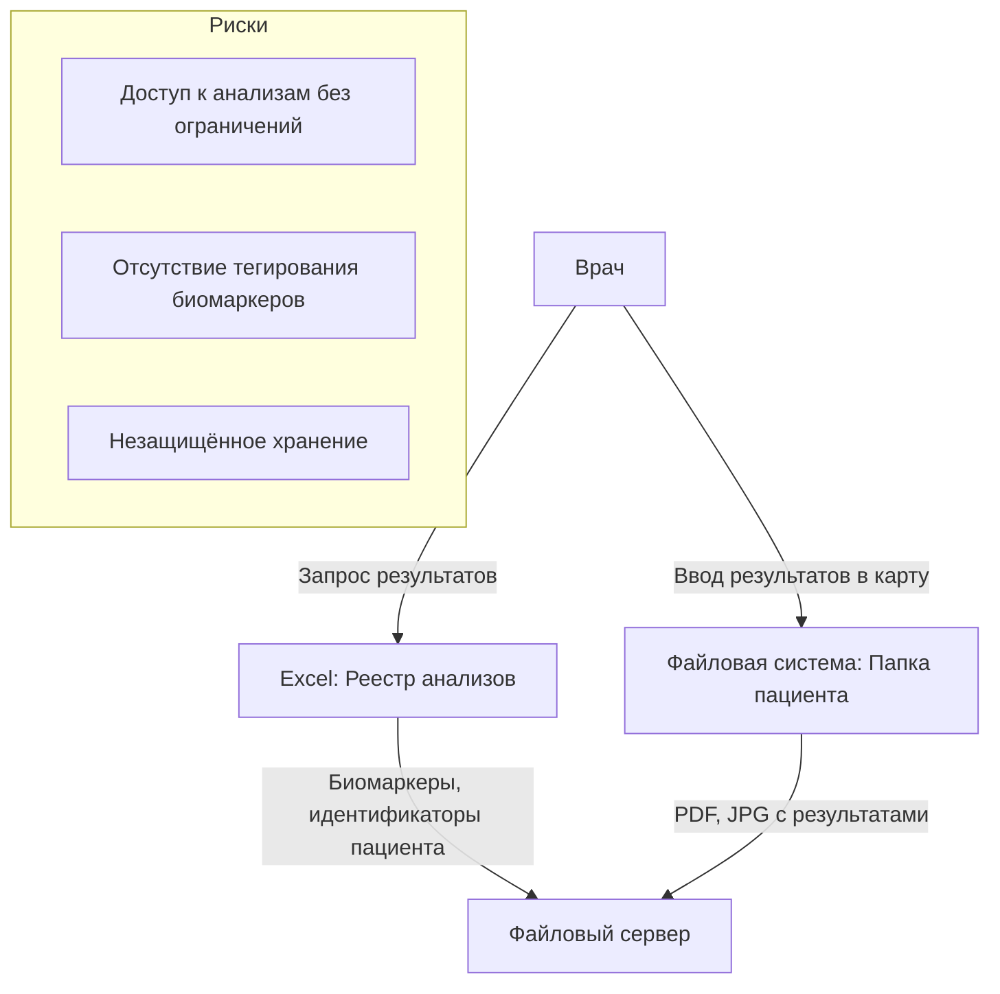
```mermaid
graph TD
    A[Врач] -->|Запрос результатов| B[Excel: Реестр анализов]
    B -->|Биомаркеры, идентификаторы пациента| C[Файловый сервер]
    A -->|Ввод результатов в карту| D[Файловая система: Папка пациента]
    D -->|PDF, JPG с результатами| C
    subgraph Риски
        R1[Доступ к анализам без ограничений]
        R2[Отсутствие тегирования биомаркеров]
        R3[Незащищённое хранение]
    end
```

### Процесс 7: Отправка почтовых уведомлений
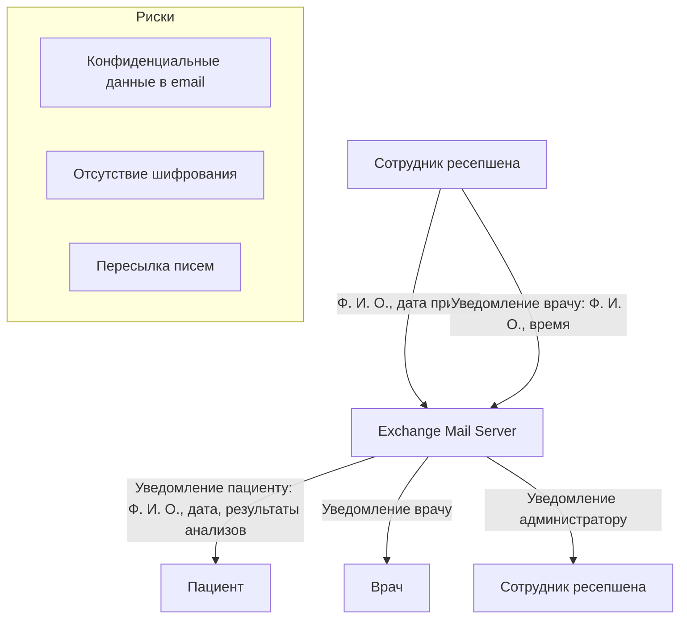
```mermaid
graph TD
    A[Сотрудник ресепшена] -->|Ф. И. О., дата приёма| B[Exchange Mail Server]
    A -->|Уведомление врачу: Ф. И. О., время| B
    B -->|Уведомление пациенту: Ф. И. О., дата, результаты анализов| C[Пациент]
    B -->|Уведомление врачу| D[Врач]
    B -->|Уведомление администратору| E[Сотрудник ресепшена]
    subgraph Риски
        R1[Конфиденциальные данные в email]
        R2[Отсутствие шифрования]
        R3[Пересылка писем]
    end
```

### Процесс 8: Заключение договоров с пациентами
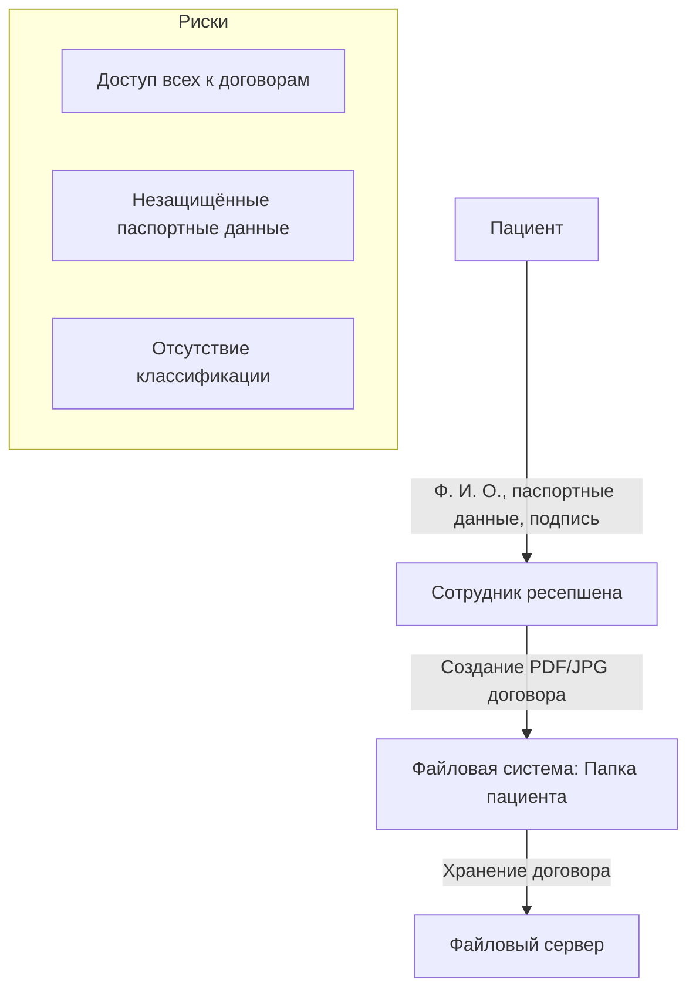
```mermaid
graph TD
    A[Пациент] -->|Ф. И. О., паспортные данные, подпись| B[Сотрудник ресепшена]
    B -->|Создание PDF/JPG договора| C[Файловая система: Папка пациента]
    C -->|Хранение договора| D[Файловый сервер]
    subgraph Риски
        R1[Доступ всех к договорам]
        R2[Незащищённые паспортные данные]
        R3[Отсутствие классификации]
    end
```

### Процесс 9: Отправка результатов лабораторных анализов
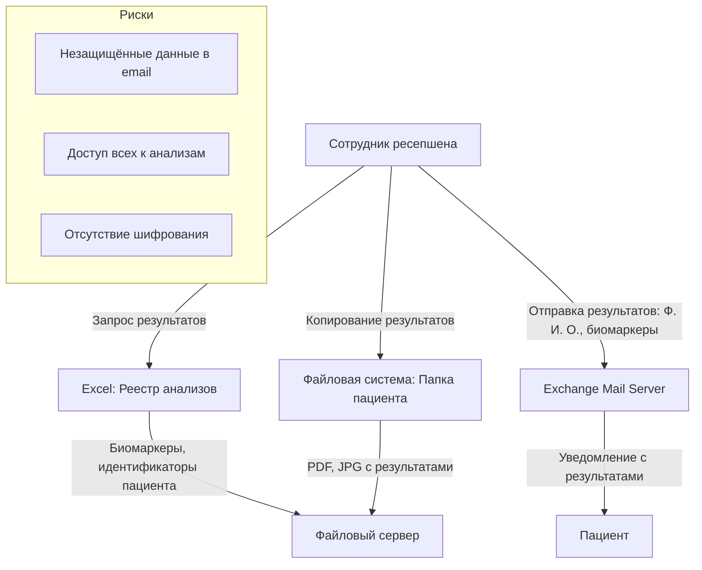
```mermaid
graph TD
    A[Сотрудник ресепшена] -->|Запрос результатов| B[Excel: Реестр анализов]
    B -->|Биомаркеры, идентификаторы пациента| C[Файловый сервер]
    A -->|Копирование результатов| D[Файловая система: Папка пациента]
    D -->|PDF, JPG с результатами| C
    A -->|Отправка результатов: Ф. И. О., биомаркеры| E[Exchange Mail Server]
    E -->|Уведомление с результатами| F[Пациент]
    subgraph Риски
        R1[Незащищённые данные в email]
        R2[Доступ всех к анализам]
        R3[Отсутствие шифрования]
    end
```

## Аудит мер по обеспечению безопасности данных в компании «Медикаменте»

### Требования к безопасности данных
На основе ФЗ-152, GDPR (в части применимости к лучшим практикам) и стандартов безопасности (например, ISO/IEC 27001) определены следующие требования:
1. **Конфиденциальность**: Данные должны быть доступны только уполномоченным лицам (RBAC/ABAC).
2. **Целостность**: Данные не должны быть изменены без контроля.
3. **Доступность**: Данные должны быть доступны для уполномоченных пользователей при необходимости.
4. **Аудит и трассировка**: Все операции с данными должны логироваться (Data Lineage).
5. **Минимизация данных**: Сбор и хранение только необходимых данных (Data Minimization).
6. **Шифрование**: Данные должны быть зашифрованы при хранении и передаче.
7. **Удаление данных**: Возможность удаления данных по запросу клиента.
8. **Privacy by Design**: Безопасность должна быть встроена в архитектуру систем.

### Архитектурные практики безопасности
1. **Классификация данных**: Тегирование данных по уровню конфиденциальности.
2. **Контроль доступа**: Внедрение RBAC/ABAC для ограничения доступа.
3. **Шифрование**: Использование AES-256 для хранения и TLS 1.3 для передачи.
4. **Аудит**: Логирование операций с данными в системах SIEM (например, ELK Stack).
5. **DLP-системы**: Предотвращение утечек данных (Data Loss Prevention).
6. **Сегментация сети**: Разделение сетей для разных типов данных и пользователей.
7. **Мониторинг и алертинг**: Обнаружение аномалий в доступе (например, с помощью Victoria Metrics).
8. **Регулярное тестирование**: Пентесты и анализ уязвимостей.

### Сопоставление процессов с требованиями и практиками

#### Процесс 1: Регистрация пациента на ресепшене
- **Описание**: Пациент предоставляет Ф. И. О., дату рождения, телефон, email, адрес, хронические заболевания, паспортные данные, СНИЛС. Данные вносятся в Excel (журнал записей, список пациентов) и PDF/JPG (договоры), хранятся на файловом сервере. Уведомления отправляются через Exchange Mail Server.
- **Конфиденциальные данные**: Персональные данные, паспортные данные, СНИЛС.
- **Текущее состояние**:
    - Доступ к файлам на сервере ограничен доменной аутентификацией, без RBAC/ABAC.
    - Данные не шифруются при хранении и передаче.
    - Нет аудита операций с данными.
    - Уведомления содержат Ф. И. О. и даты без защиты.
- **Соответствие требованиям**:
    - Нарушение конфиденциальности: доступ возможен для всех сотрудников.
    - Нарушение целостности: данные могут быть изменены без контроля.
    - Нарушение аудита: операции не логируются.
    - Нарушение минимизации: сбор избыточных данных без обоснования.
    - Нарушение шифрования: данные в PDF/JPG и email не защищены.
- **Соответствие практикам**:
    - Отсутствует классификация данных.
    - Нет контроля доступа, шифрования, DLP, мониторинга.

#### Процесс 2: Приём у врача и обработка медицинских данных
- **Описание**: Врач просматривает журнал записей, запрашивает медицинские карты и анализы, создаёт заключения и рецепты. Данные хранятся в Excel и PDF/JPG на файловом сервере.
- **Конфиденциальные данные**: Медицинские данные, результаты анализов, рецепты.
- **Текущее состояние**:
    - Доступ к файлам без ролевого контроля.
    - Данные не тегированы как чувствительные.
    - Нет шифрования и аудита.
- **Соответствие требованиям**:
    - Нарушение конфиденциальности: врачи и другие сотрудники могут видеть все данные.
    - Нарушение целостности: возможны несанкционированные изменения.
    - Нарушение аудита: нет логов операций.
    - Нарушение шифрования: данные в Excel/PDF незащищены.
- **Соответствие практикам**:
    - Отсутствует классификация, шифрование, контроль доступа, DLP.

#### Процесс 3: Обработка платежей
- **Описание**: Пациент оплачивает услуги, кассир вносит данные в ККМ и Excel. Данные передаются в «1С Бухгалтерия» через TCP/IP-OLE.
- **Конфиденциальные данные**: Финансовые данные, банковские реквизиты, Ф. И. О.
- **Текущее состояние**:
    - Реквизиты записываются вручную, хранятся в Excel без защиты.
    - Передача данных через OLE не шифруется.
    - Нет аудита операций.
- **Соответствие требованиям**:
    - Нарушение конфиденциальности: доступ к данным в Excel для всех.
    - Нарушение целостности: возможны ошибки при ручном вводе.
    - Нарушение шифрования: данные не защищены при передаче.
    - Нарушение аудита: нет логов.
- **Соответствие практикам**:
    - Отсутствует классификация, шифрование, DLP, мониторинг.

#### Процесс 4: Учёт товарно-материальных ценностей (ТМЦ)
- **Описание**: Сотрудник склада вносит данные в «1С Торговля и склад», данные обмениваются с «1С Бухгалтерия» и хранятся на сервере.
- **Конфиденциальные данные**: Идентификаторы закупок (могут содержать данные поставщиков).
- **Текущее состояние**:
    - Доступ к данным без ролевого контроля.
    - Нет шифрования и аудита.
- **Соответствие требованиям**:
    - Нарушение конфиденциальности: данные доступны всем с доступом к «1С».
    - Нарушение аудита: операции не логируются.
    - Нарушение шифрования: данные не защищены.
- **Соответствие практикам**:
    - Отсутствует классификация, контроль доступа, шифрование.

#### Процесс 5: Бухгалтерский учёт и кадровые данные
- **Описание**: Бухгалтер вносит данные сотрудников (Ф. И. О., паспорт, СНИЛС, зарплаты) в «1С Бухгалтерия», данные хранятся на сервере.
- **Конфиденциальные данные**: Данные сотрудников.
- **Текущее состояние**:
    - Доступ ко всем данным для всех бухгалтеров.
    - Нет шифрования и аудита.
- **Соответствие требованиям**:
    - Нарушение конфиденциальности: отсутствие ролевого контроля.
    - Нарушение шифрования: данные не защищены.
    - Нарушение аудита: нет логов.
- **Соответствие практикам**:
    - Отсутствует классификация, шифрование, контроль доступа.

#### Процесс 6: Обработка лабораторных анализов
- **Описание**: Врач запрашивает результаты анализов из Excel, вносит их в медицинскую карту (PDF/JPG).
- **Конфиденциальные данные**: Биомаркеры, идентификаторы пациентов.
- **Текущее состояние**:
    - Доступ к анализам без ограничений.
    - Данные не тегированы и не шифруются.
    - Нет аудита.
- **Соответствие требованиям**:
    - Нарушение конфиденциальности: данные доступны всем.
    - Нарушение целостности: возможны изменения.
    - Нарушение шифрования и аудита.
- **Соответствие практикам**:
    - Отсутствует классификация, шифрование, DLP.

#### Процесс 7: Отправка почтовых уведомлений
- **Описание**: Сотрудник ресепшена отправляет уведомления (Ф. И. О., даты, результаты анализов) через Exchange Mail Server пациенту, врачу и администратору.
- **Конфиденциальные данные**: Ф. И. О., даты, результаты анализов.
- **Текущее состояние**:
    - Данные в email не шифруются.
    - Нет фильтрации конфиденциальных данных.
    - Нет аудита отправки.
- **Соответствие требованиям**:
    - Нарушение конфиденциальности: данные доступны при пересылке.
    - Нарушение шифрования: email незащищены.
    - Нарушение аудита: нет логов.
- **Соответствие практикам**:
    - Отсутствует DLP, шифрование, мониторинг.

#### Процесс 8: Заключение договоров с пациентами
- **Описание**: Пациент предоставляет паспортные данные и подпись, сотрудник ресепшена создаёт PDF/JPG договора, хранит на сервере.
- **Конфиденциальные данные**: Паспортные данные, подписи.
- **Текущее состояние**:
    - Доступ к договорам без ограничений.
    - Данные не шифруются.
    - Нет аудита.
- **Соответствие требованиям**:
    - Нарушение конфиденциальности: данные доступны всем.
    - Нарушение шифрования и аудита.
- **Соответствие практикам**:
    - Отсутствует классификация, шифрование, контроль доступа.

#### Процесс 9: Отправка результатов лабораторных анализов
- **Описание**: Сотрудник ресепшена запрашивает результаты анализов из Excel, копирует их в папку пациента и отправляет пациенту через Exchange Mail Server.
- **Конфиденциальные данные**: Биомаркеры, Ф. И. О., идентификаторы пациентов.
- **Текущее состояние**:
    - Доступ к анализам без контроля.
    - Данные в email и Excel не шифруются.
    - Нет аудита.
- **Соответствие требованиям**:
    - Нарушение конфиденциальности: данные доступны всем.
    - Нарушение шифрования: email и файлы незащищены.
    - Нарушение аудита: нет логов.
- **Соответствие практикам**:
    - Отсутствует DLP, шифрование, классификация.

### Проблемные зоны
1. **Отсутствие классификации данных**:
    - Данные (персональные, медицинские, финансовые) не помечены как конфиденциальные, что затрудняет их защиту.
    - Нарушение Privacy by Design и ФЗ-152.

2. **Недостаточный контроль доступа**:
    - Доступ к данным ограничен только доменной аутентификацией, без RBAC/ABAC.
    - Все сотрудники с доступом к серверу могут просматривать и изменять данные.

3. **Отсутствие шифрования**:
    - Данные в Excel, PDF, JPG, «1С» и email не шифруются при хранении и передаче.
    - Нарушение конфиденциальности и целостности.

4. **Отсутствие аудита и Data Lineage**:
    - Операции с данными не логируются, невозможно отследить несанкционированный доступ.
    - Нарушение ФЗ-152 и ISO/IEC 27001.

5. **Ручная обработка данных**:
    - Ввод данных вручную увеличивает риск ошибок и утечек.
    - Отсутствие автоматизации для минимизации данных.

6. **Незащищённые email-уведомления**:
    - Уведомления содержат Ф. И. О., даты, результаты анализов без шифрования.
    - Риск перехвата и пересылки.

7. **Отсутствие DLP-систем**:
    - Нет механизмов предотвращения утечек данных (например, копирование файлов или отправка email).

8. **Несоответствие ФЗ-152**:
    - Нет механизмов удаления данных по запросу клиента.
    - Отсутствует классификация и защита данных, что влечёт штрафы.

9. **Отсутствие мониторинга и алертинга**:
    - Нет систем обнаружения аномалий или несанкционированного доступа.
    - Невозможно оперативно реагировать на инциденты.

10. **Физическая безопасность**:
    - Сервер находится в офисе без упоминания физической защиты (например, доступа к серверной комнате).

### Рекомендации
- Внедрить классификацию данных и тегирование.
- Настроить RBAC/ABAC для контроля доступа.
- Использовать шифрование (AES-256, TLS 1.3).
- Внедрить SIEM для аудита и мониторинга.
- Разработать DLP-системы для предотвращения утечек.
- Автоматизировать процессы для минимизации ручного ввода.
- Обеспечить физическую безопасность серверов.

## Комплексное улучшение безопасности данных в компании «Медикаменте»

### 1. Список конфиденциальных данных и способы их защиты

#### Категории конфиденциальных данных
Конфиденциальные данные, обрабатываемые, но не учтённые должным образом, включают:

- **Персональные данные пациентов**:
    - Обязательные: Ф. И. О., дата рождения, телефон, электронная почта.
    - Дополнительные: адрес прописки, место работы/учёбы, хронические заболевания, паспортные данные, СНИЛС.
    - **Проблемы**: Хранятся в Excel, PDF, JPG без классификации, шифрования, доступны всем.
    - **Способы защиты**:
        - **Шифрование**: AES-256 (хранение в PostgreSQL), TLS 1.3 (передача через API).
        - **Обфускация**: Маскировка телефона (XXX-XXX-XX-XX), СНИЛС (XXX-XXX-XXX-XX) в интерфейсах.
        - **Обезличивание**: Хэширование (SHA-256) для BI/ML, замена Ф. И. О. на UUID.
    - **Улучшения**: Формы CRM с тегированием, RBAC (доступ для ресепшена), уведомления о сборе данных (ФЗ-152).

- **Медицинские данные**:
    - Результаты анализов, заключения, медицинские карты, рецепты, история посещений.
    - **Проблемы**: Хранятся в Excel/PDF без тегирования, защиты от копирования.
    - **Способы защиты**:
        - **Шифрование**: AES-256 (база), TLS 1.3 (передача в приложение).
        - **Обфускация**: Скрытие биомаркеров в интерфейсах, коды вместо диагнозов.
        - **Обезличивание**: Токены (UUID) для ML, агрегация данных для исследований.
    - **Улучшения**: Структурированная база, DLP для запрета копирования, тегирование («диагноз», «анализ»).

- **Финансовые данные**:
    - Суммы, даты, способы оплаты, банковские реквизиты (карты, счета).
    - **Проблемы**: Ручной ввод в Excel, нет классификации, шифрования.
    - **Способы защиты**:
        - **Шифрование**: AES-256 (база), TLS 1.3 (платёжный шлюз).
        - **Обфускация**: Маскировка карт (XXXX-XXXX-XXXX-1234) в интерфейсах.
        - **Обезличивание**: Хэши транзакций для аналитики, удаление Ф. И. О.
    - **Улучшения**: Токенизация платежей, автоматизация ввода, аудит в SIEM.

- **Данные сотрудников**:
    - Ф. И. О., паспорт, СНИЛС, банковские счета, зарплаты.
    - **Проблемы**: Хранятся в «1С» без шифрования, доступ для всех бухгалтеров.
    - **Способы защиты**:
        - **Шифрование**: AES-256 (база), TLS 1.3 (передача).
        - **Обфускация**: Маскировка СНИЛС, ограничение данных в отчётах.
        - **Обезличивание**: Хэши для аналитики зарплат.
    - **Улучшения**: HRM-система, RBAC (доступ по ролям), мониторинг (Victoria Metrics).

- **Данные лабораторных анализов**:
    - Биомаркеры, результаты тестов, идентификаторы пациентов.
    - **Проблемы**: Excel без защиты, доступ для всех, нет тегирования.
    - **Способы защиты**:
        - **Шифрование**: AES-256 (база), TLS 1.3 (API лабораторий).
        - **Обфускация**: Коды биомаркеров в интерфейсах.
        - **Обезличивание**: Токены (UUID) для исследований.
    - **Улучшения**: API с токенизацией, структурированная база, DLP.

- **Данные в почтовых уведомлениях**:
    - Ф. И. О., даты, результаты анализов.
    - **Проблемы**: Передаются без шифрования, не фильтруются.
    - **Способы защиты**:
        - **Шифрование**: S/MIME (email), AES-256 (архивы).
        - **Обфускация**: Идентификаторы вместо Ф. И. О., ссылки на портал.
        - **Обезличивание**: Удаление персональных данных из уведомлений.
    - **Улучшения**: Защищённый портал, DLP для фильтрации, токены.

- **Данные в договорах**:
    - Паспорт, подписи, Ф. И. О.
    - **Проблемы**: PDF/JPG без шифрования, доступ для всех.
    - **Способы защиты**:
        - **Шифрование**: AES-256 (хранение), TLS 1.3 (передача).
        - **Обфускация**: Маскировка паспорта (XXXX-XXXXXX).
        - **Обезличивание**: Удаление персональных данных для аналитики.
    - **Улучшения**: ЭЦП, структурированная база, RBAC.

- **Логи транзакций ККМ**:
    - Идентификаторы, суммы, Ф. И. О.
    - **Проблемы**: Передача через OLE без шифрования, нет защиты.
    - **Способы защиты**:
        - **Шифрование**: AES-256 (база), TLS 1.3 (передача).
        - **Обфускация**: Идентификаторы вместо Ф. И. О.
        - **Обезличивание**: Хэши транзакций для аналитики.
    - **Улучшения**: API платёжного шлюза, аудит в SIEM, RBAC.

### 2. Механизм тегирования данных и меры обеспечения конфиденциальности

#### Механизм тегирования
Тегирование классифицирует данные для защиты, контроля доступа и аудита, соответствуя ФЗ-152 и Privacy by Design.

##### Категории тегов
- **Тип данных**: `Personal`, `Medical`, `Financial`, `Employee`, `Contract`, `Notification`.
- **Чувствительность**: `High` (паспорт, диагнозы), `Medium` (Ф. И. О.), `Low` (обезличенные).
- **Контекст**: `Internal` (ресепшен, врачи), `External` (API, уведомления), `Analytics` (BI/ML).

##### Процесс тегирования
1. **Обнаружение**: Сканирование файлов (Excel, PDF) и систем («1С», Exchange) с шаблонами (например, паспорт: `\d{4}-\d{6}`).
2. **Классификация**: Автоматическое (`Personal:Medium` для email) и ручное (PDF с диагнозами) присвоение тегов.
3. **Присвоение**: Сохранение тегов в PostgreSQL или метаданных файлов.
4. **Контроль доступа**: RBAC/ABAC на основе тегов (например, `Medical:High` для врачей).
5. **Аудит**: Логирование операций с тегами в SIEM.

##### Инструменты тегирования (доступные в РФ)
- **Обнаружение и классификация**:
    - **Informatica Data Catalog**: Сканирование и тегирование (`Personal`, `Medical`).
    - **Varonis Data Classification Engine**: Обнаружение паспортов, СНИЛС.
- **DLP**:
    - **Symantec DLP**: Блокировка копирования (`Medical:High`).
    - **McAfee DLP**: Контроль передачи (`Financial:High`).
- **IAM**:
    - **Azure Active Directory**: RBAC для тегов (`Medical` для врачей).
    - **OneTrust**: Интеграция тегов с облаком.
- **SIEM**:
    - **Splunk**: Логирование операций с тегами.
    - **IBM QRadar**: Мониторинг аномалий.
- **Облачные метки**:
    - **Azure Information Protection**: Тегирование в облаке.
    - **OneTrust**: Теги для CRM.
- **Комплексное управление**:
    - **Informatica**: Тегирование в базе.
    - **Collibra**: Каталог тегированных данных.
    - **OneTrust**: Соответствие ФЗ-152.

##### Способы тегирования
- **Автоматическое**: Informatica, Varonis (шаблоны для СНИЛС).
- **Ручное**: Collibra, OneTrust (PDF-договоры).
- **Полуавтоматическое**: Informatica, Splunk (предложение тегов с подтверждением).
- **API-интеграция**: Azure Information Protection (теги для лабораторных данных).

#### Меры обеспечения конфиденциальности
Меры применяются к процессам: регистрация, приём, платежи, ТМЦ, бухгалтерия, анализы, уведомления, договоры, отправка результатов.

| **Поток** | **Меры** | **Инструменты** | **Улучшения** |
|-----------|----------|----------------|---------------|
| **Регистрация** | Шифрование (AES-256, TLS 1.3), RBAC (`Personal:High`), DLP, тегирование | Informatica, Symantec DLP, Azure AD | CRM-формы, уведомления ФЗ-152 |
| **Приём** | Шифрование, RBAC (`Medical:High`), DLP, тегирование | Varonis, McAfee DLP, Splunk | Структурированная база, аудит |
| **Платежи** | Шифрование, RBAC (`Financial:High`), DLP, тегирование | Informatica, Symantec DLP, Azure AD | Токенизация, автоматизация |
| **ТМЦ** | Шифрование, RBAC (`Contract:Medium`), тегирование | Collibra, Splunk | Интеграция «1С», аудит |
| **Бухгалтерия** | Шифрование, RBAC (`Employee:High`), тегирование | OneTrust, IBM QRadar | HRM-система, мониторинг |
| **Анализы** | Шифрование, RBAC (`Medical:High`), DLP, тегирование | Varonis, McAfee DLP, Azure Information Protection | API лабораторий, база |
| **Уведомления** | Шифрование (S/MIME), DLP (`Notification:High`), тегирование | Symantec DLP, OneTrust, Splunk | Портал, токены |
| **Договоры** | Шифрование, RBAC (`Contract:High`), тегирование | Informatica, Azure AD | ЭЦП, база |
| **Результаты анализов** | Шифрование, DLP (`Medical:High`), RBAC, тегирование | McAfee DLP, Azure Information Protection, Splunk | Портал, аудит |

#### Дополнительные меры
- **Физическая безопасность**: Биометрия для серверной комнаты.
- **Обучение**: Тренинги по ФЗ-152.
- **Пентесты**: Раз в полгода.
- **Резервное копирование**: Шифрованные копии (AES-256).
- **ФЗ-152**: Уведомления о сборе, удаление данных по запросу.

### 3. Доработанные диаграммы потоков данных (DFD)
DFD для процессов включают меры безопасности: шифрование, RBAC, DLP, тегирование, аудит.

#### Процесс 1: Регистрация пациента на ресепшене
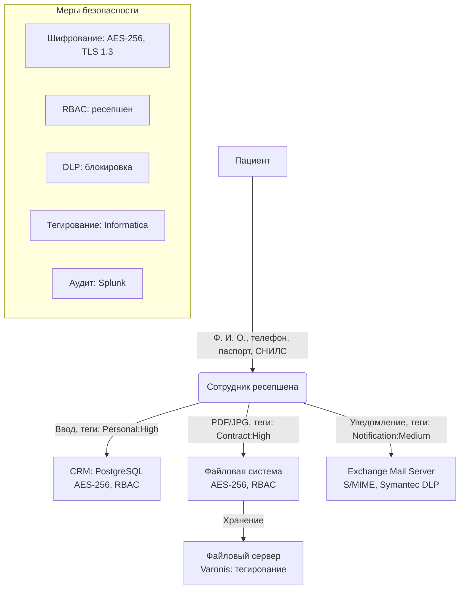
```mermaid
graph TD
    A[Пациент] -->|Ф. И. О., телефон, паспорт, СНИЛС| B(Сотрудник ресепшена)
    B -->|Ввод, теги: Personal:High| C[CRM: PostgreSQL<br>AES-256, RBAC]
    B -->|PDF/JPG, теги: Contract:High| D[Файловая система<br>AES-256, RBAC]
    D -->|Хранение| E[Файловый сервер<br>Varonis: тегирование]
    B -->|Уведомление, теги: Notification:Medium| F[Exchange Mail Server<br>S/MIME, Symantec DLP]
    subgraph Меры безопасности
        M1[Шифрование: AES-256, TLS 1.3]
        M2[RBAC: ресепшен]
        M3[DLP: блокировка]
        M4[Тегирование: Informatica]
        M5[Аудит: Splunk]
    end
```

#### Процесс 2: Приём у врача и обработка медицинских данных
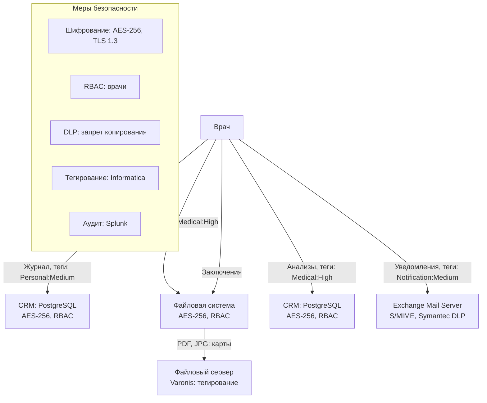
```mermaid
graph TD
    A[Врач] -->|Журнал, теги: Personal:Medium| B[CRM: PostgreSQL<br>AES-256, RBAC]
    A -->|Данные, теги: Medical:High| C[Файловая система<br>AES-256, RBAC]
    C -->|PDF, JPG: карты| D[Файловый сервер<br>Varonis: тегирование]
    A -->|Анализы, теги: Medical:High| E[CRM: PostgreSQL<br>AES-256, RBAC]
    A -->|Заключения| C
    A -->|Уведомления, теги: Notification:Medium| F[Exchange Mail Server<br>S/MIME, Symantec DLP]
    subgraph Меры безопасности
        M1[Шифрование: AES-256, TLS 1.3]
        M2[RBAC: врачи]
        M3[DLP: запрет копирования]
        M4[Тегирование: Informatica]
        M5[Аудит: Splunk]
    end
```

#### Процесс 3: Обработка платежей
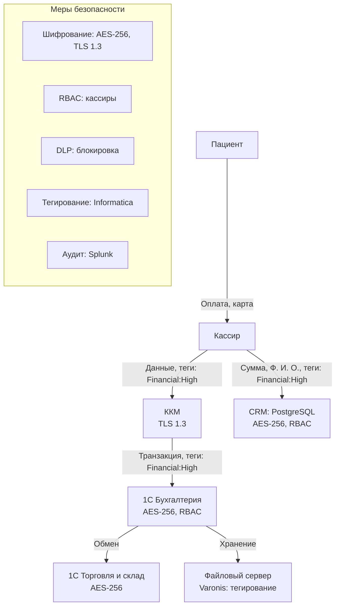
```mermaid
graph TD
    A[Пациент] -->|Оплата, карта| B[Кассир]
    B -->|Данные, теги: Financial:High| C[ККМ<br>TLS 1.3]
    B -->|Сумма, Ф. И. О., теги: Financial:High| D[CRM: PostgreSQL<br>AES-256, RBAC]
    C -->|Транзакция, теги: Financial:High| E[1С Бухгалтерия<br>AES-256, RBAC]
    E -->|Обмен| F[1С Торговля и склад<br>AES-256]
    E -->|Хранение| G[Файловый сервер<br>Varonis: тегирование]
    subgraph Меры безопасности
        M1[Шифрование: AES-256, TLS 1.3]
        M2[RBAC: кассиры]
        M3[DLP: блокировка]
        M4[Тегирование: Informatica]
        M5[Аудит: Splunk]
    end
```

#### Процесс 4: Учёт товарно-материальных ценностей (ТМЦ)
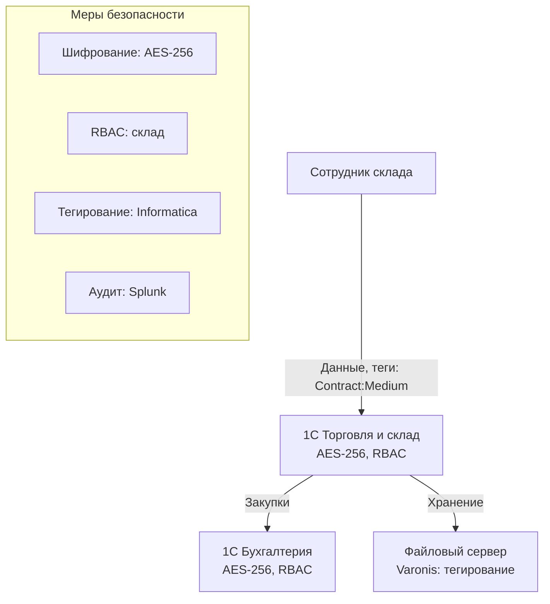
```mermaid
graph TD
    A[Сотрудник склада] -->|Данные, теги: Contract:Medium| B[1С Торговля и склад<br>AES-256, RBAC]
    B -->|Закупки| C[1С Бухгалтерия<br>AES-256, RBAC]
    B -->|Хранение| D[Файловый сервер<br>Varonis: тегирование]
    subgraph Меры безопасности
        M1[Шифрование: AES-256]
        M2[RBAC: склад]
        M3[Тегирование: Informatica]
        M4[Аудит: Splunk]
    end
```

#### Процесс 5: Бухгалтерский учёт и кадровые данные
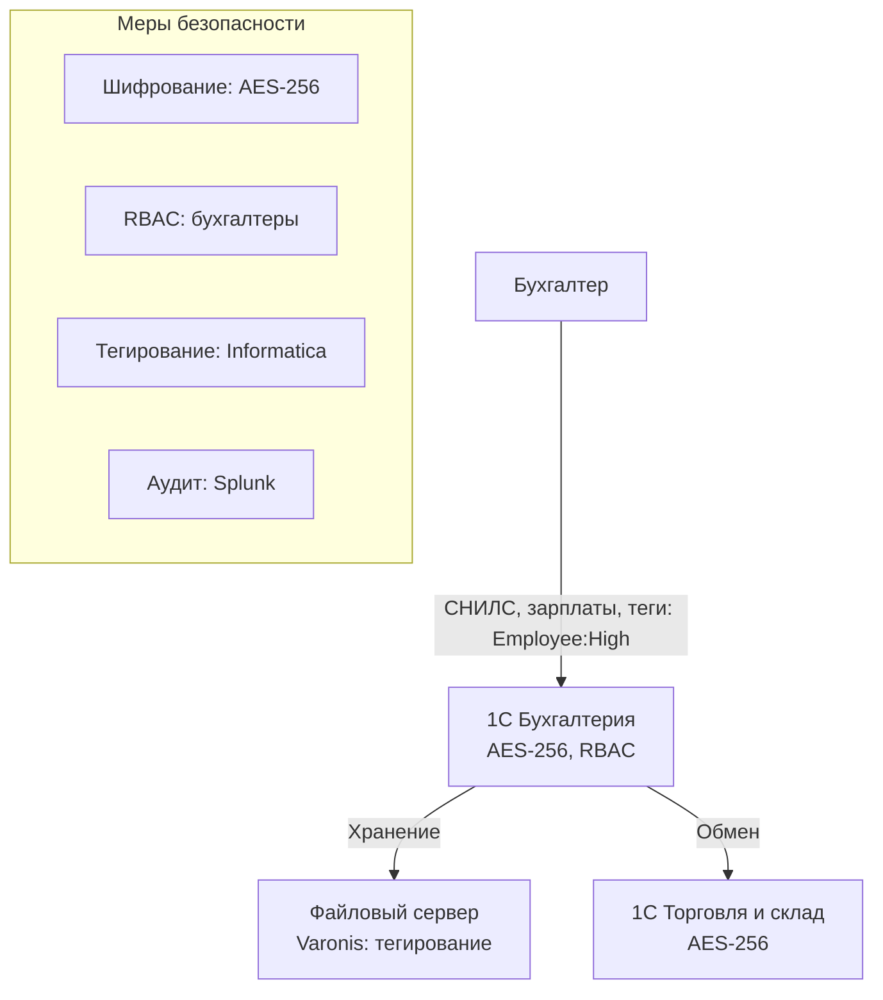
```mermaid
graph TD
    A[Бухгалтер] -->|СНИЛС, зарплаты, теги: Employee:High| B[1С Бухгалтерия<br>AES-256, RBAC]
    B -->|Хранение| C[Файловый сервер<br>Varonis: тегирование]
    B -->|Обмен| D[1С Торговля и склад<br>AES-256]
    subgraph Меры безопасности
        M1[Шифрование: AES-256]
        M2[RBAC: бухгалтеры]
        M3[Тегирование: Informatica]
        M4[Аудит: Splunk]
    end
```

#### Процесс 6: Обработка лабораторных анализов
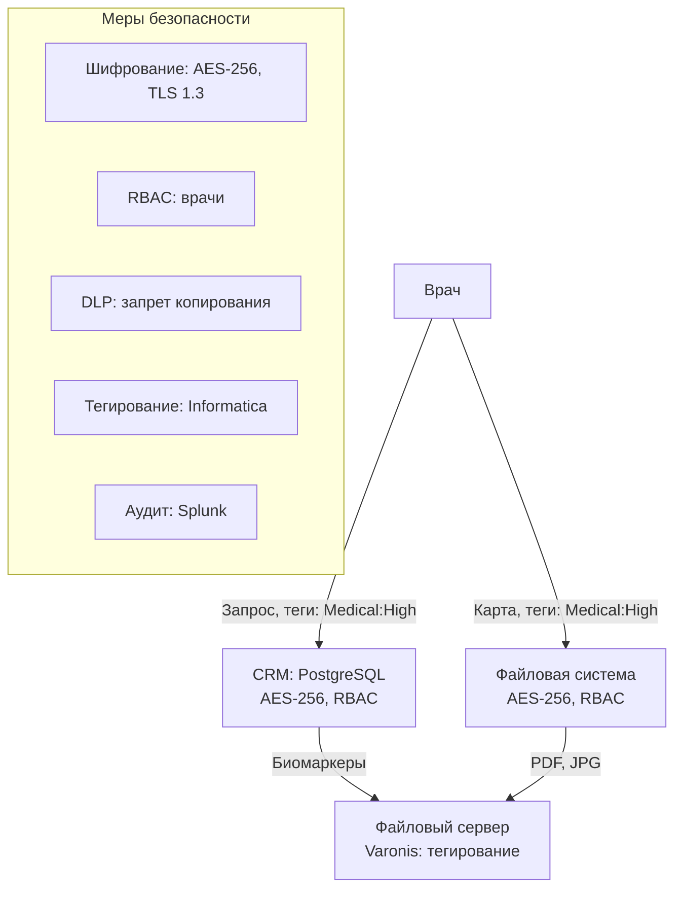
```mermaid
graph TD
    A[Врач] -->|Запрос, теги: Medical:High| B[CRM: PostgreSQL<br>AES-256, RBAC]
    B -->|Биомаркеры| C[Файловый сервер<br>Varonis: тегирование]
    A -->|Карта, теги: Medical:High| D[Файловая система<br>AES-256, RBAC]
    D -->|PDF, JPG| C
    subgraph Меры безопасности
        M1[Шифрование: AES-256, TLS 1.3]
        M2[RBAC: врачи]
        M3[DLP: запрет копирования]
        M4[Тегирование: Informatica]
        M5[Аудит: Splunk]
    end
```

#### Процесс 7: Отправка почтовых уведомлений
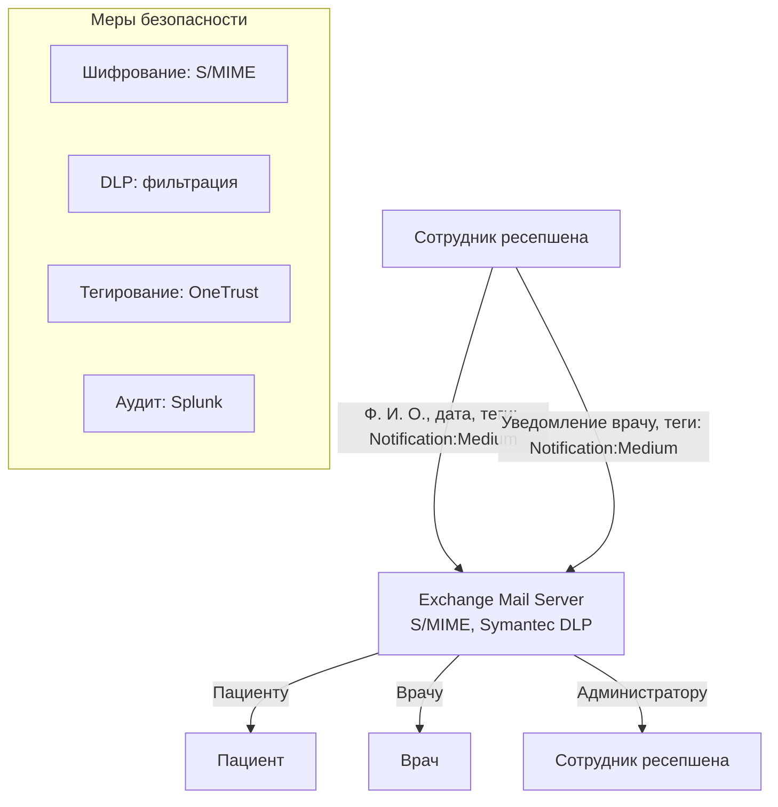
```mermaid
graph TD
    A[Сотрудник ресепшена] -->|Ф. И. О., дата, теги: Notification:Medium| B[Exchange Mail Server<br>S/MIME, Symantec DLP]
    A -->|Уведомление врачу, теги: Notification:Medium| B
    B -->|Пациенту| C[Пациент]
    B -->|Врачу| D[Врач]
    B -->|Администратору| E[Сотрудник ресепшена]
    subgraph Меры безопасности
        M1[Шифрование: S/MIME]
        M2[DLP: фильтрация]
        M3[Тегирование: OneTrust]
        M4[Аудит: Splunk]
    end
```

#### Процесс 8: Заключение договоров с пациентами
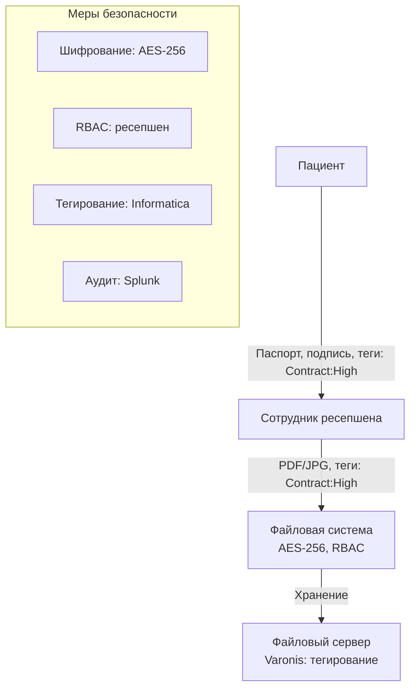
```mermaid
graph TD
    A[Пациент] -->|Паспорт, подпись, теги: Contract:High| B[Сотрудник ресепшена]
    B -->|PDF/JPG, теги: Contract:High| C[Файловая система<br>AES-256, RBAC]
    C -->|Хранение| D[Файловый сервер<br>Varonis: тегирование]
    subgraph Меры безопасности
        M1[Шифрование: AES-256]
        M2[RBAC: ресепшен]
        M3[Тегирование: Informatica]
        M4[Аудит: Splunk]
    end
```

#### Процесс 9: Отправка результатов лабораторных анализов
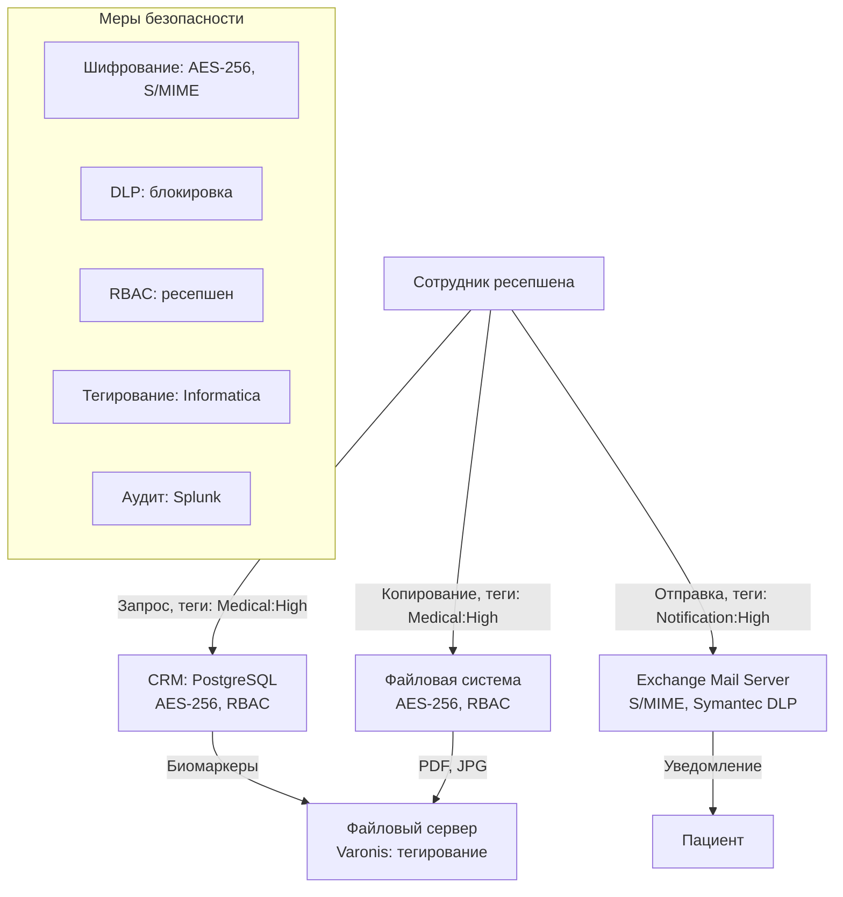
```mermaid
graph TD
    A[Сотрудник ресепшена] -->|Запрос, теги: Medical:High| B[CRM: PostgreSQL<br>AES-256, RBAC]
    B -->|Биомаркеры| C[Файловый сервер<br>Varonis: тегирование]
    A -->|Копирование, теги: Medical:High| D[Файловая система<br>AES-256, RBAC]
    D -->|PDF, JPG| C
    A -->|Отправка, теги: Notification:High| E[Exchange Mail Server<br>S/MIME, Symantec DLP]
    E -->|Уведомление| F[Пациент]
    subgraph Меры безопасности
        M1[Шифрование: AES-256, S/MIME]
        M2[DLP: блокировка]
        M3[RBAC: ресепшен]
        M4[Тегирование: Informatica]
        M5[Аудит: Splunk]
    end
```

